# Subsystem Dependency Map

This document maps current recommendation subsystems, their responsibilities, and allowed dependency directions. See [`canonical-status.md`](canonical-status.md) for maturity and roadmap status.

## Dependency rules

- Contracts and pure normalization precede provider implementations.
- Protocol/provider details must not leak into generic profile, scoring, or serving contracts.
- Authorization, eligibility, consent, and privacy checks occur before private-data processing.
- User-private personalization remains local-first by default.
- Replayable inputs must not reach additive profile state without idempotency and retraction semantics.
- Infrastructure dependencies remain behind adapters.

## Current high-level graph

```mermaid
flowchart LR
  A[Schema, Dataset, Catalog] --> B[Validation and Canonical Normalization]
  B --> C[Protocol and Provider Record Normalization]
  C --> D[Authorization and Source Eligibility]
  D --> E[Consent and Privacy Enforcement]
  E --> F[Generic Source Interest and Entity Derivation]

  C --> L1[ATProto Label Ingestion]
  L1 --> L2[Labeler Subscription Policy]
  L2 --> LB[Existing Direct Label Bridge]
  LB -. neutral canonical_interest; semantic risk .-> F
  L2 --> L3[Label Semantic Classification - required next]
  L3 --> L4[Signal Effect Policy - required next]
  L4 --> F

  F --> S[Idempotent Signal Ledger - required next]
  S --> P[Profile Store and Persistence]
  P --> M[Embedding Lifecycle]
  M --> R[ANN Retrieval]
  F --> G[Entity and Graph Intelligence]
  R --> H[Hybrid Scoring]
  G --> H
  P --> J[Local Preferences and Reranking]
  H --> J
  J --> X[Explanations and Candidate Serving]

  Q[Security and Safety Adapters] --> D
  Q --> X
```



The dotted direct-label edge is implemented today by `createRecommendationInterestSignalFromLabelerEvidence`. It converts accepted label values to neutral `canonical_interest` signals by default. That path is useful for preserving auditable evidence, but it does not classify label purpose and must not be treated as the future ranking-safe path.

Nodes marked “required next” are missing orchestration or semantic boundaries. Profile, embedding, retrieval, scoring, explanation, and serving primitives already exist.

## 1. Dataset, schema, and catalog

Primary modules:

- `schema/interest-cluster.schema.json`
- `datasets/interests.global.v1.json`
- `src/types`
- `src/validation`
- `src/normalization`
- `src/loaders`
- `src/recommendation/catalog*`
- `src/recommendation/global-catalog*`

Responsibilities:

- define portable canonical interest data;
- normalize hashtags and identifiers;
- load immutable local or remote datasets;
- resolve topics, aliases, tokens, and local entity metadata;
- preserve discovery and sensitive-topic boundaries.

Must not depend on protocol clients, user profiles, ANN providers, or scoring.

## 2. Protocol/provider source normalization

Primary modules:

- `src/signals`
- `src/recommendation/source-adapter.ts`
- `src/recommendation/protocol-source-contexts.ts`
- `src/recommendation/protocol-source-normalizers.ts`
- `src/recommendation/protocol-source-provider-records.ts`
- `src/recommendation/protocol-source-adapters.ts`
- `src/recommendation/protocol-provider-source-adapters.ts`
- `src/recommendation/canonical-source-adapter.ts`

Responsibilities:

- map already-fetched provider data to canonical source items;
- preserve operation, visibility, access basis, provenance, and exclusion semantics;
- reject malformed ActivityPub, Mastodon-shaped, and ATProto records.

Must not fetch remote data or depend on profile, ANN, or scoring internals.

## 3. Authorization, eligibility, consent, and privacy

Primary modules:

- `src/recommendation/protocol-source-authorization.ts`
- `src/recommendation/consent.ts`
- `src/recommendation/consent-enforcement.ts`
- `src/recommendation/consent-gated-source-adapter.ts`
- source eligibility modules
- `docs/privacy-model.md`

Responsibilities:

- validate provider authorization evidence;
- enforce subject, visibility, access-basis, provider-policy, and server-processing constraints;
- evaluate consent deny-by-default;
- emit privacy-safe audit reasons;
- prevent restricted data from reaching derivation or ranking without authorization.

Must not implement provider transport or authentication SDKs.

## 4. Label ingestion and labeler evidence

Primary modules:

- `src/recommendation/atproto-labels.ts`
- `src/recommendation/labeler-signal-policy.ts`
- `src/recommendation/labeler-interest-signal-derivation.ts`

Implemented responsibilities:

- normalize free-standing ATProto labels outside repository-record mapping;
- preserve labeler provenance, target, value, timestamps, expiration, signature metadata, and negation;
- merge label state with tombstone and out-of-order safety;
- require active user-scoped labeler subscription evidence and matching consent;
- expose a direct bridge from accepted evidence to neutral interest signals.

Current limitation:

The direct bridge defaults accepted label values to `canonical_interest`. It does not distinguish topical labels from moderation, safety, identity, community, content-format, game, eligibility, or unknown labels. It must not be connected automatically to positive ranking effects.

Required next boundaries:

1. semantic classification;
2. signal-effect policy;
3. idempotent and retractable application to subject state.

## 5. Interest signals and idempotent application

Primary implemented modules:

- `src/recommendation/interest-signal.ts`
- `src/recommendation/interest-signal-derivation.ts`
- `src/recommendation/labeler-interest-signal-derivation.ts`

Responsibilities:

- normalize target, action, polarity, strength, confidence, data use, privacy boundary, provenance, consent, and expiration;
- derive signals from normalized source items and accepted label evidence.

Missing application layer:

- stable signal/source-event identity;
- deduplication and replay ordering;
- retractions and tombstones;
- expiration cleanup;
- crash-safe retry behavior.

Live or replayable provider streams must not write directly to additive profile state until this layer exists.

## 6. Profile state and persistence

Primary modules:

- `src/recommendation/profile-store.ts`
- `src/recommendation/profile-store-persistence.ts`
- `src/recommendation/profile-store-persistence-*`
- `src/recommendation/onboarding-profile-seed.ts`
- `src/recommendation/onboarding-profile-bootstrap.ts`

Responsibilities:

- aggregate normalized signals into redacted subject profiles;
- enforce configured privacy boundaries;
- prune expiration and cap retained entries;
- derive pseudonymous persistence keys;
- validate, verify, persist, read, and delete records;
- bootstrap local profiles from explicit onboarding selections.

Known gap:

The low-level in-memory store can be explicitly configured to accept `aggregate_only`, even though subject-level onboarding and durable persistence reject that boundary. Integrations must not enable that configuration until the store or profile orchestrator enforces the invariant directly.

## 7. Embedding lifecycle and ANN retrieval

Primary modules:

- `src/recommendation/embedding-lifecycle.ts`
- `src/embedding`
- `src/ann`
- `src/adapters/pgvector`
- `src/adapters/pglite`

Responsibilities:

- define embedding providers and model manifests;
- fingerprint source profiles;
- validate vectors and artifact integrity;
- evaluate expiration, invalidation, model/profile drift, and dimension mismatch;
- route retrieval through replaceable ANN providers.

Must not parse protocol records or independently authorize source data.

## 8. Entity and graph intelligence

Primary modules:

- `src/entities`
- `src/graph`

Responsibilities:

- extract and resolve entities;
- map entities to interest clusters;
- build co-occurrence graphs and communities;
- prune, serialize, and replay graph state.

Private source data requires the same consent and privacy boundaries used elsewhere.

## 9. Scoring, personalization, explanation, and serving

Primary modules:

- `src/scoring`
- `src/local-preferences`
- `src/serving/candidates.ts`

Responsibilities:

- combine deterministic, entity, graph, embedding, global bandit, contextual bandit, and session signals;
- apply local preference and semantic reranking;
- project explanations;
- bound, filter, exclude, deduplicate, and rank candidates.

Must not depend directly on provider transports or leak private state in explanations.

## 10. Security and optional safety adapters

Primary modules:

- `src/security/url-sanitizer.ts`
- `src/security/google-safe-browsing.ts`
- shared retry and validation utilities

Responsibilities:

- sanitize external URLs and identifiers;
- classify bounded retry behavior;
- optionally enrich URL/domain safety;
- expose privacy-safe failure categories.

## Required orchestration paths

### Current provider path

```text
provider client outside core
→ provider record mapper
→ protocol normalizer
→ authorization evidence
→ eligibility and consent
→ generic signal derivation
```

### Current label path

```text
queryLabels / subscribeLabels adapter outside core
→ label normalization and authoritative state merge
→ user labeler subscription policy
→ existing direct neutral-interest bridge
```

The last step preserves evidence but is not semantic classification.

### Required future label path

```text
label normalization and authoritative state merge
→ user labeler subscription policy
→ semantic classification
→ signal-effect policy
→ idempotent/retractable signal application
→ profile or policy-state update
```

### Required end-to-end recommendation path

```text
source reads
→ authorization / eligibility / consent
→ normalization and derivation
→ idempotent signal ledger
→ profile and embedding freshness
→ candidate retrieval
→ hybrid scoring
→ local reranking and policy exclusions
→ explanations
→ bounded serving
```

No single public orchestrator currently implements this full path.

## Boundary guardrails

- Unknown provider input fails closed.
- Restricted reads require authorization evidence.
- Consent precedes private or server-side processing.
- The direct label bridge is evidence-preserving, not semantic approval.
- Unknown label semantics remain audit-only in the future automatic path.
- Replayable streams require idempotency before profile application.
- Label negation must retract prior effects.
- Aggregate-only evidence must not enter per-subject profiles.
- Profile and embedding deletion follow deletion intents.
- ANN failures must not corrupt ranking or profile state.
- Candidate serving remains deterministic for equivalent inputs.
- Logs, errors, metrics, and explanations remain privacy-safe.

## Operational focus

- semantic label classification and effect policy;
- signal identity, deduplication, replay, and retraction;
- end-to-end orchestration;
- freshness policies for datasets, profile embeddings, and ANN artifacts;
- privacy-safe fallback and circuit observability;
- live protocol adapters;
- reference local and durable persistence adapters;
- performance, concurrency, replay, and recovery testing.
