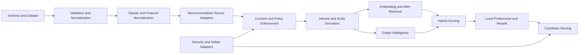

# Subsystem Dependency Map

This document maps major subsystems, their responsibilities, and allowed dependency directions.

## Dependency rules

- Contracts first: interfaces in core modules define behavior before provider implementations.
- Flow direction is inward to outward: normalization and contracts feed retrieval, scoring, and serving.
- Protocol and provider details must not leak into generic scoring and serving contracts.
- Consent and safety are cross-cutting controls that apply before recommendation output.

## High-level subsystem graph

## Module ownership by subsystem

### 1. Dataset contract and ingestion

Primary modules:
- src/types
- schema/interest-cluster.schema.json
- src/validation/validator.ts
- src/normalization/hashtags.ts
- src/loaders/dataset-loader.ts
- src/loaders/remote-loader.ts

Responsibility:
- Define strict dataset shape and reject invalid payloads.
- Canonicalize hashtags and strings for consistent lookup behavior.
- Provide immutable local and remote loading paths.

Depends on:
- JSON schema and validation runtime.

Must not depend on:
- ANN, scoring, provider-specific adapters.

### 2. Protocol signal normalization and source mapping

Primary modules:
- src/signals
- src/recommendation/protocol-source-normalizers.ts
- src/recommendation/protocol-source-provider-records.ts
- src/recommendation/protocol-source-adapters.ts
- src/recommendation/canonical-source-adapter.ts

Responsibility:
- Normalize protocol/provider records into canonical recommendation events and source items.
- Enforce strict operation, visibility, and collection constraints.

Depends on:
- Recommendation source contracts and protocol context utilities.

Must not depend on:
- ANN provider internals, storage-specific implementation details.

### 3. Consent, privacy, and enforcement

Primary modules:
- src/recommendation/consent.ts
- src/recommendation/consent-enforcement.ts
- src/recommendation/consent-gated-source-adapter.ts
- docs/privacy-model.md

Responsibility:
- Evaluate consent policy for data use, visibility, and access basis.
- Enforce fail-closed behavior and privacy-safe audit events.
- Gate source reads and derived-data deletion behavior.

Depends on:
- Source adapter contracts and recommendation context.

Must not depend on:
- Provider-specific transport logic.

### 4. Entity and graph intelligence

Primary modules:
- src/entities
- src/graph

Responsibility:
- Extract and link entities.
- Map entities to clusters.
- Build and maintain co-occurrence graph intelligence.

Depends on:
- Dataset cluster definitions and entity resolver contracts.

Must not depend on:
- Provider-specific ingestion logic.

### 5. Embedding and ANN orchestration

Primary modules:
- src/embedding
- src/ann
- src/adapters/pgvector
- src/adapters/pglite

Responsibility:
- Generate embeddings and refresh them safely.
- Route ANN operations through capability-aware orchestrators.
- Support resilient provider selection, fallback, and circuit behavior.

Depends on:
- Embedding and ANN contracts.

Must not depend on:
- Protocol-specific source parsing.

### 6. Scoring, personalization, and serving

Primary modules:
- src/scoring
- src/local-preferences
- src/serving/candidates.ts
- src/recommendation/profile-store*

Responsibility:
- Combine deterministic, entity, graph, embedding, and bandit signals.
- Apply local-first preference and semantic rerank behavior.
- Serve bounded, deduplicated, and explainable candidates.

Depends on:
- Canonical source items, embedding similarity, local profile state.

Must not depend on:
- Provider SDKs directly.

### 7. Safety and external security adapters

Primary modules:
- src/security/url-sanitizer.ts
- src/security/google-safe-browsing.ts

Responsibility:
- Sanitize URLs and domains before downstream use.
- Optionally enrich safety posture via Safe Browsing checks.

Depends on:
- Sanitization and network utility behavior.

Must not depend on:
- Recommendation ranking internals.

## Concrete dependency paths

### Path A: Dataset to retrieval

1. schema/interest-cluster.schema.json
2. src/validation/validator.ts
3. src/loaders/dataset-loader.ts or src/loaders/remote-loader.ts
4. src/embedding/orchestrator.ts
5. src/ann/orchestrator.ts
6. src/scoring/hybrid.ts

### Path B: Provider record to candidate

1. src/recommendation/protocol-source-provider-records.ts
2. src/recommendation/protocol-source-normalizers.ts
3. src/recommendation/protocol-source-adapters.ts
4. src/recommendation/consent-gated-source-adapter.ts
5. src/recommendation/interest-signal-derivation.ts
6. src/scoring/hybrid.ts
7. src/local-preferences/semantic-profile.ts
8. src/serving/candidates.ts

### Path C: Safety gate integration

1. src/security/url-sanitizer.ts
2. src/security/google-safe-browsing.ts
3. src/recommendation/consent-enforcement.ts
4. src/serving/candidates.ts

## Boundary guardrails

- Source adapters must output normalized RecommendationSourceItem shapes.
- Consent evaluation must happen before private-data processing.
- ANN provider failures must not corrupt ranking state.
- Serving must remain deterministic for identical input and exclusion sets.

## Operational focus areas

- Retry and backoff consistency across all networked modules.
- Freshness and staleness controls for dataset, embeddings, and ANN snapshots.
- Privacy-safe telemetry only, especially for consent and enforcement outcomes.
- Circuit-breaker observability for provider fallback and recovery.
